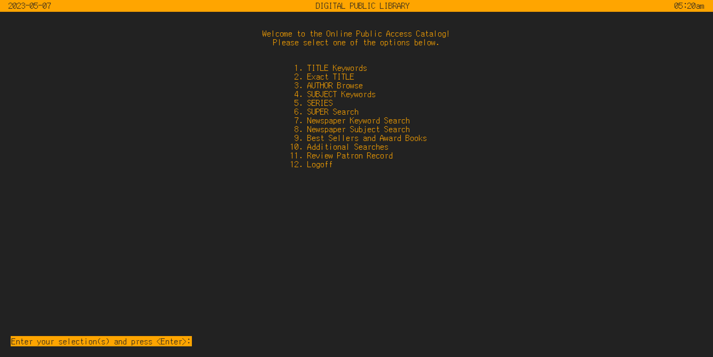

# retro-ui-vue

Trying to recreate [this Dynix terminal UI](https://en.wikipedia.org/wiki/Dynix_(software)#/media/File:Dynix-Main-Menu-via-Telnet.jpg) as a single page web app using Vue. (If that statement makes you feel aghast, then I've succeeded.) Here's the result as of the time of writing:



## Recommended IDE Setup

[VSCode](https://code.visualstudio.com/) + [Volar](https://marketplace.visualstudio.com/items?itemName=Vue.volar) (and disable Vetur) + [TypeScript Vue Plugin (Volar)](https://marketplace.visualstudio.com/items?itemName=Vue.vscode-typescript-vue-plugin).

## Customize configuration

See [Vite Configuration Reference](https://vitejs.dev/config/).

## Project Setup

```sh
npm install
```

### Compile and Hot-Reload for Development

```sh
npm run dev
```

### Compile and Minify for Production

```sh
npm run build
```
